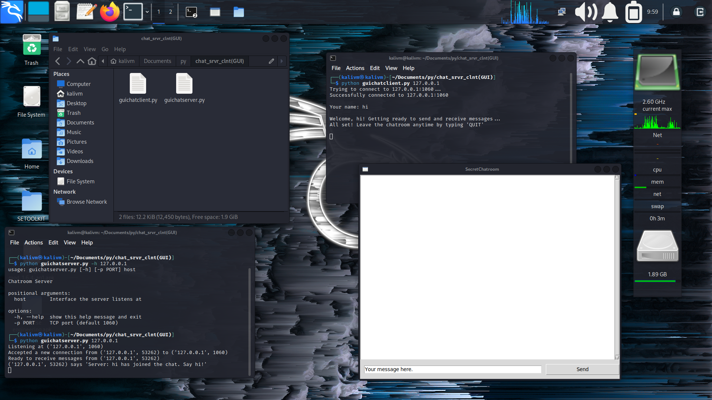
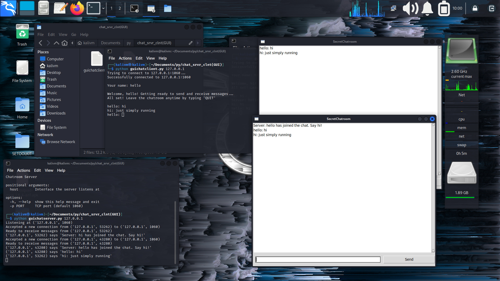
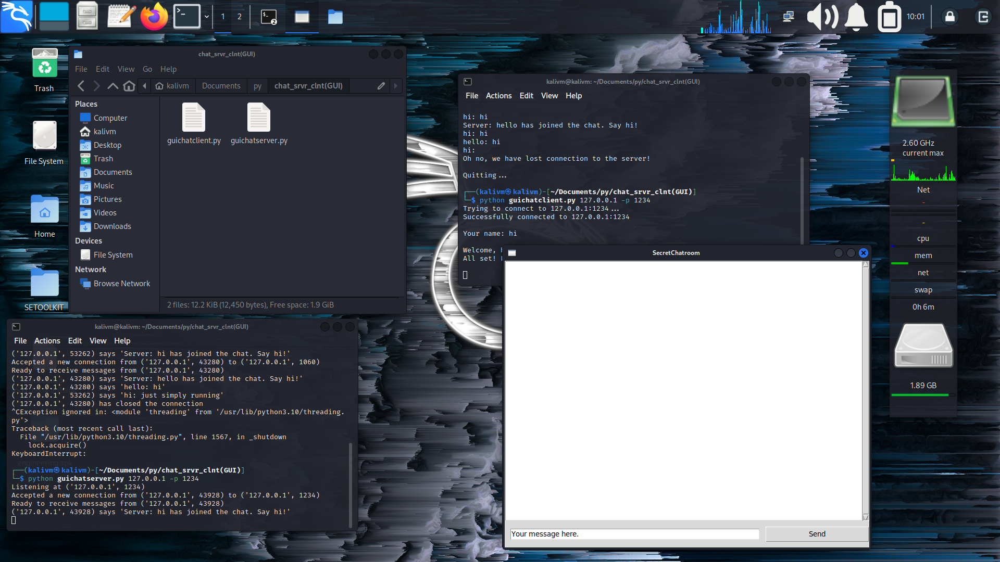

# Chat-Application-GUI

### We can chat online/over internet safely without records
>Note: If the server wants to save records it can save

#### The server.py should run only on on device or only one time to connect multiple clients
#### The Client.py is to run for chatting with other clients . It connects to server.py
#

>Note: If you use specific port no. on server ,the same port no. must be used in client

#

>on server: we have to give the ip or domain first
```python
python guichatserver.py <ip/domain>
```

>on client: we have to give the ip or domain first
```python
python guichatclient.py <ip/domain>
```

# if want specific port

>if wants to use on specific port we have to use '-p'
>
```python
python guichatserver.py <ip/domain> -p <port no.>
```
```python
python guichatclient.py <ip/domain> -p <port no.>
```

>It works on every os which have installed python

#Screenshots
> without specific port



#

>with specific port

